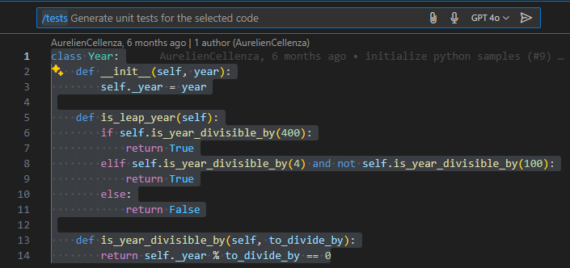

# Challenge instructions for `/tests` command

## Step 1: Generate tests for `year.py`

### Instructions

1. Open the `year.py` file in the folder `LeapYearsKata`.
2. In VS Code, press `ctrl + i` with the cursor on the class name.
3. Type `/tests` and press enter.

### Observations

To note:

1. Copilot should ask you for the testing framewrok to use and further configuration if you never did before.
2. It proposes to write the answer in a new file.
3. Check the generated tests and see if they fit with the code you are reading.

## Step 2: Generate tests for `number.py`

### Instructions

1. Open the `number.py` file in the folder `SumOfDigitsKata`.
2. In VS Code, press `ctrl + i` with the cursor on the class name.
3. Type `/tests` and press enter.

### Observations

To note:

1. It proposes to write the answer in a new file.
2. Check the generated tests and see if they fit with the code you are reading.

## Step 3: Generate tests for `number.py` using a template

### Instructions
*Open a new chat*

1. Open the `number.py` file in the folder `SumOfDigitsKata`.
2. In VS Code, press `ctrl + i` with the cursor on the class name.
3. Type `/tests` and specify that you want to use the file `number_test_template_1.py` as a template.

### Observations
1. The proposed results should be different from step 2.
2. Redo the same experiment but with `number_test_template_2.py` open and check the response difference.

*Note: Copilot is good at replicating templates. Giving it examples to work on improves the output quality.*

## Step 4: Generate tests in ComplexMethod project

### Instructions

Here is the modified version using Python files:

1. Generate a test for the execute method in search_in_dictionary.py.
2. Save this test as search_in_dictionary_tests_step1.py.

3. Replace the verify_ip_address call in execute with verify_ip_address_simple.

4. Regenerate the test for execute in search_in_dictionary.py.

5. Compare search_in_dictionary_tests_step1.py with the new result.

### Observations

1. There is a limit of number of test that can be generated
2. You need small methods to generate efficiant test with Copilot 
3. With many nested methods, you can't generate all unit tests